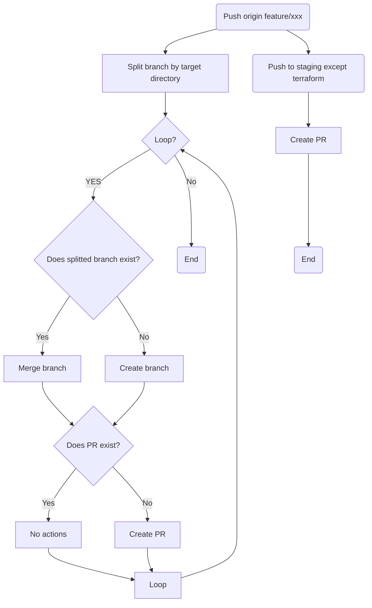
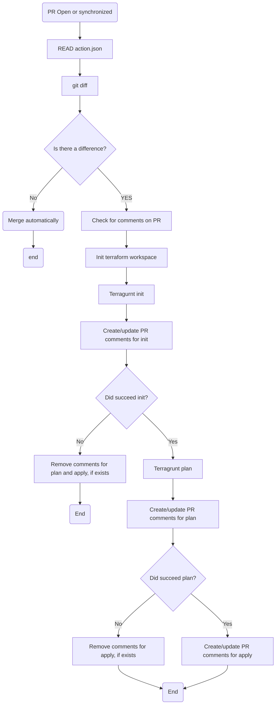
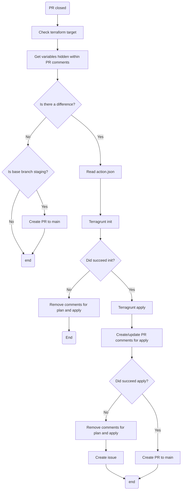

# infra-cicd-template
Github actions for Terragrunt flow. 

## Assumption
- terraform
  - terraform workspace
  - private module
  - tfenv
- terragrunt
  - tgenv
- branch
  - main
    - staging
      - feature/a
      - feature/b
      - feature/**
- AWS (Supports multi account)
  - production 
  - staging 

## Workflow
1. Push feature/**
    - [x] Create PR for staging
    - [x] (Terraform logs(init,plan,apply) can be checked within PR.)
    - [ ] tflint,tfsec,terraform validate
    - [x] terragrunt init (staging environment)
    - [x] terragrunt plan (staging environment)
    - [x] (If the terraform are not changed, they are auto-merged.)
2. After merge feature/** into staging
    - [x] terragrunt init (staging environment)
    - [x] terragurnt apply (staging environment)
      - [ ] ~~(If terragrunt apply failed, revert commmit and create github issues.)~~ 
        - Difficulty in handling revert. some resources may have already been applied even if apply fails.
        - Apply past commit again?
          - What if it fails event more??
      - [x] (If terragrunt apply successed, create PR for staging to main )
    - [x] Delete merged branch.
3. After create PR for staging to main
    - [x] (Same as 1, but the target is the AWS production environment.)
4. After merge staging into main
    - [x] (Same as 2, but the target is the AWS production environment.)
5. Error handling
    - [x] If terragrunt apply failed, create github issues.
    - [ ] Create new branch and new pull request??
    - [ ] If terragrunt apply succeeds, the issue is automatically closed.
    - [ ] Block other CI during errors??
    - [ ] Assign a person to the issues.
6. Support for multiple envitonments (e.g. Account for front-end and back-end)
    - [x] Split and re-commit branches when changes are pushed across environments.

## Bug
- When a file in the hcl folder is modified , terraform doesnt run.

## Flow-chart

- When feature branch is pushed.

- When PR is opened or synchronized.

- When PR is closed
  - Behavior in case of failure needs to be reconsidered

## Vision for the future
- [ ] Exclusive control of github actions.
- [ ] Support for tfmigrate.
- [ [ One-click creation of github actions environment.
  - Automated github secret registration, etc.
- [ ] Terraform state lock (dynamo db).
- [x] Modularization of github actions.
- [x] Flow diagrams, etc..
- [ ] Authority minimization.
- [x] Use GitHub Apps instead of Personal Access token.

## Install
0. Fork this repository.
1. Create branch
    - `$ git checkout -b staging`
    - `$ git push origin staging`
    - `$ git checkout -b feature/<any>`
2. Setup github
    - ~~Create personal access token (full-control) and register secret named `GH_ACTION_TOKEN` to your repository~~
    - Create Github Apps and install to your repository. And, register secret named `APP_ID` and `INSTALLATION_ID`, `PRIVATE_KEY`.
    - Receive the ssh key of the repository that manages the terraform module from the administrator and register the secret named `RSA`.
3. [Setup AWS](./aws/init)
4. Copy actions.json.sample to actions.json
    - ghactions_target: Specify the directory to be used for github actions (under ./terraform directory).
    - main: Specify the target AWS account to run terrafrom when pushed to the main branch.
    - staging: Specify the target AWS account to run terrafrom when pushed to the staging branch.
      - aws_profile: Your aws_profile name
      - aws_role_arn: Roles created in 1 (apply_role).
      - tf_workspace: Any value that does not duplicate in the AWS account (used for resource names ).
5. Copy or rename ./sample directory to the directory specified by ghactions_target.
6. Rename the files in ${ghactions_target}/variables to correspoind to variable of tf_workspace in actions.json.
7. Access your repository and enable github actions (Actions tab)
8. `git add --all && git commit -m "hello cicd" && git push origin HEAD`
9. Check your github PR!!